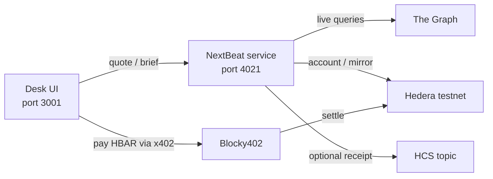

# NextBeat

**Author:** Abhishek Jha  

ETHOnline 2026 · **Hedera** · **The Graph** · **World** (slot 3 pilot — swap to ENS/Bazantic if needed)

NextBeat is a small wire desk for onchain research. You pick an assignment (for example treasury vs lending). The service pulls live protocol data from The Graph, checks Hedera testnet state, and returns the **next beat** of the investigation. That brief is paid with a tiny amount of testnet HBAR using **x402** (Blocky402 facilitator).

Everything runs on **Hedera testnet only**. Default price is **1,000 tinybars** (0.00001 HBAR).

## Live demo

| What | URL |
|---|---|
| Desk + API (one deployment) | **https://nextbeat.vercel.app** |
| Health | https://nextbeat.vercel.app/health |

Desk and service share that host. The desk calls `/v1/brief` on the same origin (`SERVICE_PUBLIC_URL=https://nextbeat.vercel.app`).

Paid buys need Hedera testnet keys in the Vercel project env (agent + service accounts). Without keys, health and the desk UI still load; `/api/buy` stays unavailable.

## Demo video

[`video/nextbeat-demo.mp4`](./video/nextbeat-demo.mp4) — ~2 min, **1280×720**, spoken English narration, **no music**, 1× real time.

## Submission images

| File | Size | Use |
|---|---|---|
| [`images/logo-512.png`](./images/logo-512.png) | 512×512 | Project logo |
| [`images/cover-640x360.png`](./images/cover-640x360.png) | 640×360 | Cover |
| [`images/screenshot-01-desk.png`](./images/screenshot-01-desk.png) | 1280×720 | Desk |
| [`images/screenshot-02-assignment.png`](./images/screenshot-02-assignment.png) | 1280×720 | Assignment form |
| [`images/screenshot-03-beat.png`](./images/screenshot-03-beat.png) | 1280×720 | Settled beat |

## How it works



1. Open the desk and choose an assignment.  
2. Call **quote** (free) to see the metered price.  
3. Call **brief** — the service answers `402 Payment Required`.  
4. The agent pays dust HBAR through Blocky402 on testnet.  
5. After settle, you get the next investigation beat (Graph + Hedera fused). Optional: a short receipt on an HCS topic.

**Slot 3:** World Selfie Check gates the desk before x402 spend. World feedback: [`docs/world-selfie-feedback.md`](./docs/world-selfie-feedback.md). Prize alignment: [`plan.md`](./plan.md#sponsor-prize-alignment-ethonline-2026).

## Repo layout

| Path | Role |
|---|---|
| `nextbeat-app/packages/service` | HTTP API: health, quote, paid brief |
| `nextbeat-app/packages/agent` | Desk UI that quotes, pays, and shows the beat |
| `nextbeat-app/packages/shared` | Shared types, env, quote math |

## How to run

**Need:** Node **20.19+**, two Hedera **testnet ECDSA** accounts from [portal.hedera.com](https://portal.hedera.com) (faucet ~1000 HBAR / 24h).

```bash
cd nextbeat-app
cp .env.example .env
# Edit .env: agent + service account IDs and private keys
# Optional: GRAPH_QUERY_URLS=url1,url2  (two live Studio/gateway endpoints)

npm install
npm test
npm run typecheck
npm run dev
```

| What | URL |
|---|---|
| Service health | http://127.0.0.1:4021/health |
| Desk UI | http://127.0.0.1:3001 |

Check that unpaid brief returns 402:

```bash
npm run smoke
```

## API

| Method | Path | Payment |
|---|---|---|
| `GET` | `/health` | none |
| `GET` | `/v1/quote?accountId=…&limit=3` | none (price preview) |
| `POST` | `/v1/brief` | x402 HBAR on testnet |

Body for brief: `{ "accountId", "assignment", "limit" }`.

## Notes

- Never commit `.env` or private keys.  
- Never use mainnet.  
- For The Graph track, set two live `GRAPH_QUERY_URLS`; the beat reasons over them instead of dumping raw GraphQL.  
- Git cadence and milestones: [`nextbeat-app/GIT.md`](./nextbeat-app/GIT.md).
